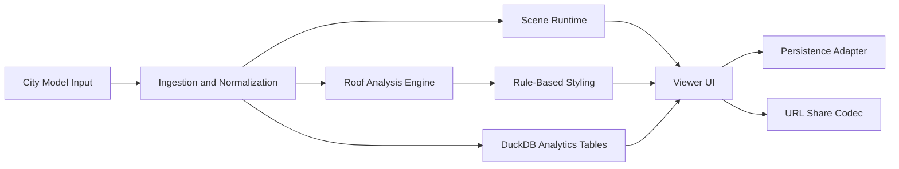

# Design Doc

Status: Draft v0.1

## 1. Background

MultiRoofs is a European project focused on turning underused urban rooftops into productive spaces for energy, biodiversity, water management, housing, and community life. The project runs from December 2024 through June 2029 under the INTERREG North-West Europe programme.

This repository supports that mission by defining a viewer and analysis tool for 3D city models. The tool should help users understand rooftop potential through a mix of geospatial visualization, rule-based analysis, solar and shading exploration, and lightweight statistics.

## 2. Problem Statement

Cities need to make decisions about rooftops using spatial data that is often difficult to inspect, compare, and communicate. Existing tools are often fragmented: one tool for viewing geometry, another for analytics, another for simulation, and another for reporting. The goal here is to create a focused workspace where users can load a city model, inspect roof geometry, derive planning insight, and share a reproducible view.

## 3. Product Vision

The product should become a browser-based rooftop analysis workspace for urban planning and research. It should make city-scale models understandable to non-specialist users while still providing enough structure for expert workflows.

The first version should optimize for clarity, explainability, and a modular architecture over maximum feature breadth.

## 3.1 Terminology

Use `citymodel` as the product and domain term for the conceptual 3D city model. Specific files should be treated as encodings of that model.

- `CityJSON` is the first supported encoding.
- `CityJSONSeq` is the second priority encoding.
- `FlatCityBuf` is the third priority encoding.

This naming keeps the application aligned with the underlying CityGML conceptual model rather than hard-wiring the codebase to a single file format.

## 4. Primary Users

- Urban planners evaluating rooftop capacity and tradeoffs.
- Researchers and students exploring rooftop-related urban scenarios.
- Public authorities participating in MultiRoofs pilot activities.
- Technical partners who need a reusable viewer for demonstrations and analysis sessions.

## 5. Scope

### In Scope for v1

- Load and visualize 3D city models, starting with CityJSON-family encodings.
- Navigate, inspect, and select buildings and roof surfaces.
- Derive roof properties such as area, slope, and orientation.
- Apply rule-based colorization based on geometry or attribute values.
- Simulate sun and shade for a user-selected date and time.
- Compute summary statistics such as average building height.
- Save workspace state locally and encode shareable view state into a URL where practical.

### Out of Scope for v1

- Authentication, user accounts, or server-backed collaboration.
- Editing source geometry.
- Full server-side persistence or multi-user project storage.
- Highly specialized engineering-grade simulation pipelines.
- Real-time collaborative annotation.

### Initial Encoding Priority

1. CityJSON
2. CityJSONSeq
3. FlatCityBuf

## 6. Core Workflows

1. A user opens a city model source and the viewer places it in a geospatially correct scene.
2. The user explores the model, selects roofs or buildings, and inspects geometry and attributes.
3. The user creates color rules such as "south-facing roofs" or "height above threshold".
4. The user adjusts date and time controls to inspect solar position and shading.
5. The user computes summary statistics for the full city model or a filtered subset.
6. The user saves the workspace locally and shares a URL that reconstructs the current view when possible.

## 7. Architecture Principles

- Keep the application browser-first for v1.
- Separate domain logic from rendering logic.
- Normalize incoming city model data before analysis.
- Keep persistence behind explicit TypeScript interfaces.
- Treat URL sharing and local persistence as separate concerns.
- Isolate platform-specific behavior so a future Tauri shell can reuse core modules.

## 8. High-Level Architecture



## 9. Proposed Module Boundaries

### App Shell

Responsible for bootstrapping the application, dependency injection, routing, and shared providers.

### City Model Ingestion

Responsible for loading source data, validating supported formats, extracting metadata, and normalizing geometry into internal structures.

### Scene Runtime

Responsible for Three.js scene lifecycle, cameras, controls, object picking, layer visibility, and rendering performance.

### Roof Analysis Engine

Responsible for derived rooftop metrics such as area, slope, aspect, centroid, and suitability flags. This layer should produce reusable analysis outputs rather than UI-specific values.

### Rule Styling Engine

Responsible for evaluating user-defined conditions against attributes or derived metrics and returning styling outputs such as color, opacity, and visibility.

### Solar and Shading Module

Responsible for computing sun position for a selected date and time, updating lighting, and enabling shadow exploration in the scene.

### Statistics Module

Responsible for building analytical tables and summary queries using DuckDB-wasm. The preferred path is to use the DuckDB `cityjson` extension so CityJSON, CityJSONSeq, and FlatCityBuf can be read directly into tables. This layer should focus on metrics and aggregations, not mesh rendering.

### Persistence Module

Responsible for saving and restoring workspace state through a storage interface. v1 will use local implementations only.

### Share Module

Responsible for encoding and decoding a lightweight URL-safe representation of the current view and filters.

## 10. Internal Domain Model

The internal model should separate source-format concerns from application concerns.

- `CityModel`: metadata, source encoding, CRS information, bounds, and raw feature references.
- `CityModelEncoding`: supported source encodings such as `cityjson`, `cityjsonseq`, and `flatcitybuf`.
- `Building`: normalized building-level entity with identifiers and aggregate metrics.
- `RoofSurface`: normalized roof facet or logical roof surface with geometric and semantic properties.
- `AnalysisMetric`: derived values such as aspect, slope, usable area, or solar score.
- `StyleRule`: user-authored condition plus a resulting visual style.
- `ViewState`: camera, selected objects, active layers, active filters, and current datetime.
- `ProjectSnapshot`: serializable state bundle for local save and restore.

## 11. Geospatial Strategy

- Preserve source CRS metadata whenever available.
- Use `three-geospatial` to manage geospatial positioning and transformations.
- Anchor rendering to a stable local scene origin to reduce floating-point precision problems in large coordinate spaces.
- Keep derived analysis values traceable back to source object identifiers.

This is important because the viewer must remain visually stable while still supporting meaningful measurements and reproducible analysis.

## 12. City Model Ingestion Strategy

The ingestion layer should be format-aware but domain-oriented.

- The application should expose a single city-model abstraction to downstream modules.
- Parsers and readers should be organized by encoding, not by feature workflow.
- Format support should expand in priority order: CityJSON, CityJSONSeq, then FlatCityBuf.
- Downstream code should depend on normalized city-model entities, not format-specific JSON shapes.

This makes it easier to add future encodings, including CityGML/XML-derived sources, without renaming core domain concepts.

## 13. Roof Analysis Strategy

The first analysis pass should derive a concise set of reusable metrics for each roof surface:

- Surface area
- Normal vector
- Slope
- Aspect or azimuth
- Elevation
- Building association
- Existing semantic attributes from the source city-model encoding

These derived values become the common foundation for:

- Suitability classification
- Rule-based colorization
- Aggregate statistics
- Filtering and selection panels

## 14. Solar and Shading Strategy

For v1, solar and shading should focus on interpretability rather than high-end simulation accuracy.

- The user chooses a date and time in the UI.
- The application computes sun position for that datetime.
- Scene lighting and shadows update accordingly.
- The same datetime becomes part of the saved view state.

Later versions can expand into scenario comparison, annual exposure summaries, or more advanced simulation techniques.

## 15. Statistics Strategy with DuckDB-wasm

DuckDB-wasm should be used for analytical queries over normalized and derived tables, not as a replacement for geometry processing.

The preferred loading strategy is the DuckDB `cityjson` extension, which provides readers for:

- `read_cityjson`
- `read_cityjsonseq`
- `read_flatcitybuf`

Recommended analytical tables:

- `building_metrics`
- `roof_metrics`
- `style_rule_results`
- `selection_membership`

Example early statistics:

- Average building height
- Average roof slope
- Count of roofs by orientation band
- Total roof area for filtered selections
- Counts or area totals by suitability class

One early technical checkpoint is to validate browser-side compatibility for the required DuckDB extension path and define a fallback if extension loading is constrained in the target runtime.

## 16. Persistence and Dependency Injection

The persistence layer should be defined through interfaces first so v1 can use local implementations without locking the application into local-only assumptions.

Illustrative contract:

```ts
export interface ProjectSnapshot {
  version: string;
  savedAt: string;
  cityModelRef: CityModelReference | null;
  viewState: ViewState;
  styleRules: StyleRule[];
  analysisConfig: AnalysisConfig;
}

export interface ProjectStateStore {
  save(snapshot: ProjectSnapshot): Promise<string>;
  load(id: string): Promise<ProjectSnapshot | null>;
  list(): Promise<Array<{ id: string; savedAt: string; label: string }>>;
  remove(id: string): Promise<void>;
}

export interface ShareStateCodec {
  encode(state: ShareableViewState): string;
  decode(token: string): ShareableViewState;
}
```

Planned v1 implementations:

- `InMemoryProjectStateStore`
- `LocalStorageProjectStateStore`
- `UrlHashShareStateCodec`

Future implementations can add server-backed persistence or Tauri-native storage without changing feature-level code.

## 17. Shareability Constraints

Saving state and sharing by URL are not the same problem.

- Local save can persist richer workspace information.
- URL sharing should focus on compact, reproducible state such as camera, datetime, active filters, and style rules.
- If the city model comes from a local file, a shared URL may not be fully reconstructable on another device without access to the same file.

This limitation should be handled explicitly in product design rather than hidden.

## 18. Proposed Success Criteria for v1

- A user can load at least one supported city-model encoding and navigate it smoothly.
- A user can inspect roof attributes and derived metrics.
- A user can define and apply simple color rules.
- A user can change datetime and see sun and shade update.
- A user can calculate a small set of meaningful statistics.
- A user can save a local workspace and restore it later.

## 19. Risks and Open Questions

- Large datasets may stress browser memory and GPU performance.
- City-model datasets may vary in semantic richness and consistency.
- DuckDB extension loading in the browser should be validated early for the chosen runtime.
- Roof suitability logic may need domain validation from project partners.
- URL-based sharing may need a strict size budget.
- The team may need to decide when CityGML/XML-derived support becomes a priority.
